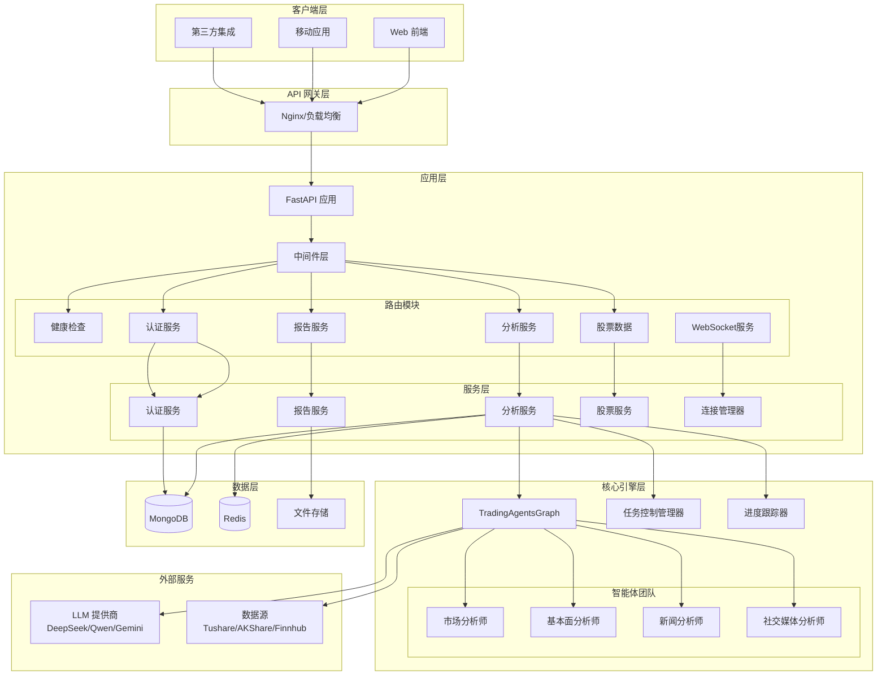
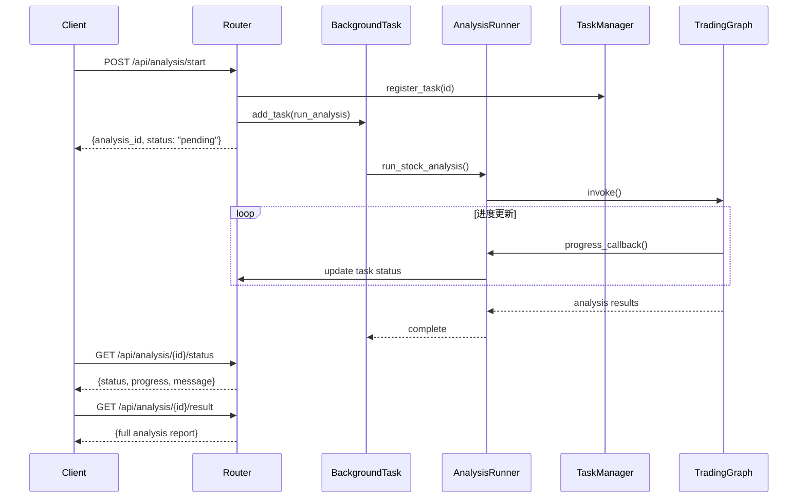
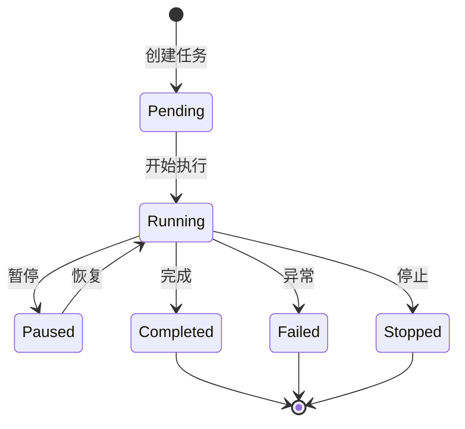

# TradingAgents 后端服务接口架构设计

## 文档概述

本文档描述了 TradingAgents 后端服务的整体架构设计，包括技术栈、系统架构、模块划分、数据流和关键设计决策。

**版本**: 1.0  
**更新时间**: 2025-12-02  
**作者**: TradingAgents 开发团队

---

## 1. 系统概述

### 1.1 项目简介

TradingAgents-CN 是一个基于多智能体和大语言模型的金融交易决策框架，为 A 股、港股和美股提供智能化的股票分析服务。后端服务基于 FastAPI 构建，提供 RESTful API 接口，支持异步任务处理、实时进度跟踪、报告生成等功能。

### 1.2 核心特性

- **多智能体分析**: 集成市场分析师、基本面分析师、新闻分析师等多个专业智能体
- **多 LLM 支持**: 支持 DeepSeek、Qwen、Google AI (Gemini)、OpenAI 等多种大语言模型
- **异步任务处理**: 支持长时间运行的分析任务，提供实时进度跟踪
- **任务控制**: 支持任务暂停、恢复、停止等精细化控制
- **多数据源集成**: 整合 Tushare、AKShare、Finnhub 等多个数据源
- **报告生成**: 支持 Markdown、Word、PDF 等多种格式的分析报告

### 1.3 技术栈

| 组件 | 技术选型 | 说明 |
|------|---------|------|
| Web 框架 | FastAPI 0.104+ | 高性能异步 Web 框架 |
| Python 版本 | Python 3.10+ | 支持最新语言特性 |
| ASGI 服务器 | Uvicorn | 生产级 ASGI 服务器 |
| 数据库 | MongoDB | NoSQL 文档数据库（计划中） |
| 缓存 | Redis | 内存数据库（计划中） |
| 任务队列 | BackgroundTasks | FastAPI 内置异步任务 |
| 认证 | JWT | JSON Web Token（计划中） |
| 数据验证 | Pydantic | 数据模型和验证 |
| 日志 | Python logging | 结构化日志记录 |

---

## 2. 系统架构

### 2.1 整体架构图



### 2.2 分层架构

#### 2.2.1 客户端层
- Web 前端（Streamlit/Vue.js）
- 移动应用
- 第三方系统集成

#### 2.2.2 API 网关层
- Nginx 反向代理
- 负载均衡
- SSL/TLS 终止
- 限流和防护

#### 2.2.3 应用层
**路由模块 (Routers)**
- 负责接收 HTTP 请求
- 参数验证和解析
- 调用服务层处理业务逻辑
- 返回标准化响应

**服务层 (Services)**
- 封装核心业务逻辑
- 协调多个组件协作
- 处理事务和异常
- 数据转换和聚合

**中间件 (Middleware)**
- CORS 跨域处理
- 请求日志记录
- 异常处理
- 认证和授权（计划中）
- 操作审计（计划中）

#### 2.2.4 核心引擎层
- **TradingAgentsGraph**: 多智能体协作引擎
- **智能体团队**: 专业化的分析智能体
- **任务管理器**: 任务生命周期管理
- **进度跟踪器**: 实时进度监控

#### 2.2.5 数据层
- **MongoDB**: 用户数据、分析结果、配置信息
- **Redis**: 缓存、会话、任务队列
- **文件存储**: 报告文件、日志文件

#### 2.2.6 外部服务
- **LLM 提供商**: DeepSeek、Qwen、Gemini、OpenAI
- **数据源**: Tushare、AKShare、Finnhub、EODHD

---

## 3. 模块设计

### 3.1 目录结构

```
app/
├── __init__.py                 # 应用初始化
├── main.py                     # FastAPI 应用入口
├── core/                       # 核心配置
│   ├── __init__.py
│   ├── config.py              # 配置管理
│   └── startup_validator.py   # 启动验证
├── routers/                    # 路由模块
│   ├── __init__.py
│   ├── health.py              # 健康检查 ✅
│   ├── analysis.py            # 分析接口 ✅
│   ├── reports.py             # 报告接口 ✅
│   ├── notifications.py       # 通知接口 ✅
│   ├── websocket.py           # WebSocket接口 ✅
│   ├── auth.py                # 认证接口 📋
│   ├── favorites.py           # 收藏接口 📋
│   ├── stocks.py              # 股票数据 📋
│   ├── screening.py           # 股票筛选 📋
│   ├── config.py              # 配置接口 📋
│   └── operation_logs.py      # 日志接口 📋
├── schemas/                    # 数据模型 (Pydantic) ✅
│   ├── __init__.py
│   ├── report.py              # 报告模型
│   └── notification.py        # 通知模型
├── services/                   # 服务层 ✅
│   ├── __init__.py
│   ├── report_service.py      # 报告服务
│   ├── notification_service.py # 通知服务
│   ├── websocket_manager.py   # WebSocket管理器 ✅
│   ├── auth_service.py        # 认证服务 📋
│   └── stock_service.py       # 股票服务 📋
├── models/                     # 数据模型 📋
│   ├── __init__.py
│   ├── analysis.py            # 分析模型
│   ├── user.py                # 用户模型
│   ├── stock.py               # 股票模型
│   └── notification.py        # 通知模型
├── middleware/                 # 中间件 📋
│   ├── __init__.py
│   ├── error_handler.py       # 异常处理
│   └── operation_log.py       # 操作日志
└── utils/                      # 工具函数 📋
    ├── __init__.py
    ├── response.py            # 响应格式化
    └── validators.py          # 自定义验证器
```

### 3.2 核心模块说明

#### 3.2.1 配置管理 (core/config.py)

**职责**:
- 加载环境变量配置
- 提供配置访问接口
- 验证配置完整性

**关键配置项**:
```python
class Settings(BaseSettings):
    # 应用配置
    APP_NAME: str = "TradingAgents-CN API"
    VERSION: str = "0.1.0"
    DEBUG: bool = True
    HOST: str = "0.0.0.0"
    PORT: int = 8000
    
    # 安全配置
    SECRET_KEY: str
    ALLOWED_HOSTS: List[str]
    ALLOWED_ORIGINS: List[str]
    
    # 日志配置
    LOG_LEVEL: str = "INFO"
    LOG_FILE: str = "logs/api.log"
    
    # 数据库配置（计划中）
    MONGODB_URL: str
    REDIS_URL: str
    
    # LLM 配置
    DEFAULT_LLM_PROVIDER: str = "dashscope"
    DEFAULT_LLM_MODEL: str = "qwen-max"
```

#### 3.2.2 分析路由 (routers/analysis.py)

**职责**:
- 接收分析请求
- 启动异步分析任务
- 提供任务状态查询
- 支持任务控制（暂停/恢复/停止）

**关键接口**:
- `POST /api/analysis/start`: 启动分析
- `GET /api/analysis/{id}/status`: 查询状态
- `GET /api/analysis/{id}/result`: 获取结果
- `POST /api/analysis/{id}/pause`: 暂停任务
- `POST /api/analysis/{id}/resume`: 恢复任务
- `POST /api/analysis/{id}/stop`: 停止任务

**数据流程**:


#### 3.2.3 任务控制管理器

**职责**:
- 注册和跟踪分析任务
- 支持任务暂停/恢复/停止
- 管理任务状态转换
- 提供任务查询接口

**状态机**:


---

## 4. 数据模型设计

### 4.1 分析请求模型

```python
class AnalysisRequest(BaseModel):
    """分析请求模型"""
    stock_symbol: str              # 股票代码
    market_type: str               # 市场类型（美股/A股/港股）
    analysis_date: Optional[str]   # 分析日期
    analysts: List[str]            # 分析师列表
    research_depth: int            # 研究深度 (1-5)
    include_sentiment: bool        # 包含情绪分析
    include_risk_assessment: bool  # 包含风险评估
    custom_prompt: Optional[str]   # 自定义提示
    extra_config: Optional[Dict]   # 额外配置
```

### 4.2 分析响应模型

```python
class AnalysisResponse(BaseModel):
    """分析响应模型"""
    analysis_id: str               # 分析任务 ID
    status: str                    # 任务状态
    message: str                   # 状态消息
```

### 4.3 任务状态模型

```python
class TaskStatus(BaseModel):
    """任务状态模型"""
    analysis_id: str               # 任务 ID
    status: str                    # 状态
    current_message: str           # 当前消息
    progress_log: List[Dict]       # 进度日志
    error: Optional[str]           # 错误信息
```

### 4.4 分析结果模型

```python
class AnalysisResult(BaseModel):
    """分析结果模型"""
    stock_symbol: str              # 股票代码
    analysis_date: str             # 分析日期
    decision: str                  # 投资决策
    confidence: float              # 置信度
    full_report: str               # 完整报告
    analyst_reports: Dict          # 各分析师报告
    risk_assessment: Optional[Dict] # 风险评估
    sentiment_analysis: Optional[Dict] # 情绪分析
    metadata: Dict                 # 元数据
```

---

## 5. 关键设计决策

### 5.1 异步任务处理

**问题**: 股票分析是计算密集型任务，可能需要数分钟完成，不能阻塞 HTTP 请求。

**解决方案**:
- 使用 FastAPI 的 `BackgroundTasks` 处理长时间运行的任务
- 立即返回任务 ID，客户端通过轮询获取状态
- 内存存储任务状态（生产环境应使用 Redis）

**优点**:
- 响应快速，用户体验好
- 支持并发处理多个分析任务
- 易于实现进度跟踪

**缺点**:
- 需要客户端轮询（未来可升级为 WebSocket）
- 内存存储不持久（服务重启会丢失）

### 5.2 任务控制机制

**问题**: 用户可能需要暂停、恢复或停止长时间运行的分析任务。

**解决方案**:
- 集成 `tradingagents.utils.task_control_manager`
- 在分析过程中定期检查任务状态
- 支持优雅的暂停和恢复

**实现**:
```python
# 在分析循环中检查任务状态
def run_analysis_step():
    task_state = get_task_state(analysis_id)
    if task_state == "paused":
        wait_for_resume()
    elif task_state == "stopped":
        raise TaskStoppedException()
    # 继续执行分析
```

### 5.3 进度跟踪

**问题**: 用户需要了解分析任务的实时进度。

**解决方案**:
- 使用回调函数机制
- 在关键步骤更新进度信息
- 存储进度日志供查询

**实现**:
```python
def progress_callback(message, step=None, total_steps=None):
    analysis_tasks[analysis_id]['progress'].append({
        'message': message,
        'step': step,
        'total_steps': total_steps,
        'timestamp': datetime.now().isoformat()
    })
```

### 5.4 实时通知机制

**问题**: 需要将分析进度实时推送到前端。

**解决方案**:
- 使用 WebSocket 建立长连接
- `WebSocketEngine` 作为消息引擎之一
- `ConnectionManager` 管理连接和广播

**实现**:
```python
# 注册广播回调
handler.engine.set_broadcast_callback(broadcast_wrapper)

# 广播消息
async def broadcast(self, message: Dict[str, Any]):
    for connection in self.active_connections:
        await connection.send_text(json.dumps(message))
```

### 5.4 配置管理

**问题**: 需要灵活配置 LLM 提供商、数据源等参数。

**解决方案**:
- 使用 Pydantic Settings 管理配置
- 支持环境变量和 .env 文件
- 提供默认值和验证

**配置优先级**:
1. 请求参数（`extra_config`）
2. 环境变量
3. 默认配置

### 5.5 错误处理

**问题**: 需要统一的错误处理和响应格式。

**解决方案**:
- 使用 FastAPI 的异常处理机制
- 定义标准错误响应格式
- 记录详细错误日志

**错误响应格式**:
```json
{
    "error": {
        "code": "ANALYSIS_FAILED",
        "message": "分析任务执行失败",
        "details": "具体错误信息",
        "timestamp": "2025-12-02T14:30:00"
    }
}
```

---

## 6. 安全设计

### 6.1 认证和授权（计划中）

**认证方式**:
- JWT (JSON Web Token)
- OAuth 2.0 密码流

**授权策略**:
- 基于角色的访问控制 (RBAC)
- API 密钥认证（第三方集成）

### 6.2 数据安全

**传输安全**:
- 强制 HTTPS（生产环境）
- TLS 1.2+

**存储安全**:
- 密码哈希（bcrypt）
- 敏感数据加密
- API 密钥安全存储

### 6.3 API 防护

**限流**:
- 基于 IP 的请求限流
- 基于用户的配额管理

**防护措施**:
- CORS 配置
- TrustedHost 中间件
- SQL 注入防护（参数化查询）
- XSS 防护

---

## 7. 性能优化

### 7.1 缓存策略

**Redis 缓存**（计划中）:
- 股票基础数据（1小时 TTL）
- 分析结果（24小时 TTL）
- 用户会话（30分钟 TTL）

### 7.2 数据库优化

**MongoDB 索引**（计划中）:
- 股票代码索引
- 用户 ID 索引
- 时间戳索引

### 7.3 并发处理

**异步 I/O**:
- 使用 `async/await` 处理 I/O 密集型操作
- 数据库查询异步化
- HTTP 请求异步化

---

## 8. 监控和日志

### 8.1 日志策略

**日志级别**:
- DEBUG: 详细调试信息
- INFO: 一般信息（请求、响应）
- WARNING: 警告信息
- ERROR: 错误信息
- CRITICAL: 严重错误

**日志内容**:
- 请求日志（URL、方法、参数）
- 响应日志（状态码、耗时）
- 错误日志（堆栈跟踪）
- 业务日志（分析任务状态变更）

### 8.2 监控指标（计划中）

**系统指标**:
- CPU 使用率
- 内存使用率
- 磁盘 I/O

**应用指标**:
- API 请求量
- 响应时间
- 错误率
- 并发任务数

**业务指标**:
- 分析任务完成率
- 平均分析时长
- 用户活跃度

---

## 9. 部署架构

### 9.1 开发环境

```
本地开发 → Uvicorn (--reload)
```

### 9.2 生产环境（推荐）

```
用户请求 → Nginx → Uvicorn (多进程) → FastAPI 应用
                  ↓
              MongoDB / Redis
```

**部署配置**:
- Nginx: 反向代理、负载均衡、SSL 终止
- Uvicorn: 4-8 个工作进程（根据 CPU 核心数）
- Supervisor: 进程管理和自动重启
- Docker: 容器化部署

### 9.3 扩展性

**水平扩展**:
- 多个 FastAPI 实例
- Nginx 负载均衡
- Redis 集群
- MongoDB 副本集

---

## 10. 未来规划

### 10.1 短期目标（3个月）

- ✅ 完成批次1-2（基础框架和分析接口）
- 📋 完成批次3-4（报告和用户系统）
- 📋 集成 MongoDB 和 Redis
- 📋 实现 JWT 认证

### 10.2 中期目标（6个月）

- 📋 完成批次5-6（数据查询和监控）
- 📋 WebSocket 实时通知
- 📋 多数据源同步
- 📋 任务调度系统

### 10.3 长期目标（12个月）

- 📋 微服务架构重构
- 📋 Kubernetes 部署
- 📋 分布式任务队列（Celery）
- 📋 实时流式分析
- 📋 AI 模型优化和微调

---

## 11. 参考资料

### 11.1 技术文档

- [FastAPI 官方文档](https://fastapi.tiangolo.com/)
- [Pydantic 文档](https://docs.pydantic.dev/)
- [MongoDB 文档](https://docs.mongodb.com/)
- [Redis 文档](https://redis.io/documentation)

### 11.2 项目文档

- `后端服务设计参考.md`: 参考设计文档
- `接口开发计划.md`: 接口开发计划
- `后端服务接口规范.md`: API 接口规范

### 11.3 代码仓库

- 主仓库: `TradingAgents-CN`
- 参考实现: `reference/TradingAgents-CN/app`

---

## 附录

### A. 术语表

| 术语 | 说明 |
|------|------|
| LLM | Large Language Model，大语言模型 |
| JWT | JSON Web Token，JSON 网络令牌 |
| ASGI | Asynchronous Server Gateway Interface，异步服务器网关接口 |
| CORS | Cross-Origin Resource Sharing，跨域资源共享 |
| TTL | Time To Live，生存时间 |
| RBAC | Role-Based Access Control，基于角色的访问控制 |

### B. 版本历史

| 版本 | 日期 | 变更说明 |
|------|------|----------|
| 1.0 | 2025-12-02 | 初始版本，基于当前实现创建 |

---

**文档维护**: 本文档应随着系统演进持续更新，确保与实际实现保持一致。
