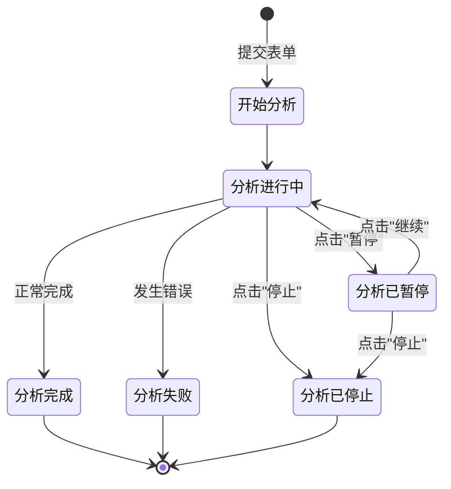

# 任务控制界面优化总结

## 📋 更新概述

本次更新优化了web应用中的任务控制功能界面，完善了"继续任务"功能的实现，并改进了开始分析、暂停、继续和停止这四个核心功能按钮的界面交互。

## ✨ 主要改进

### 1. 完善"继续任务"功能
- **问题**：用户反馈只看到暂停任务的入口，没有继续任务的部分
- **原因**：继续按钮实际已实现，但界面交互不够明显
- **解决**：
  - 在暂停状态下，"继续分析"按钮使用 `type="primary"` 高亮显示（绿色）
  - 添加明确的状态提示："点击'继续'按钮恢复分析"
  - 优化按钮布局和排列

### 2. 优化任务状态显示
为每种任务状态设计了专属的彩色渐变卡片：

| 状态 | 颜色 | 图标 | 说明 |
|------|------|------|------|
| 分析进行中 | 🟢 绿色渐变 | 🔄 | 显示分析ID |
| 分析已暂停 | 🟠 橙色渐变 | ⏸️ | 提示点击继续按钮 |
| 分析已停止 | 🔴 红色渐变 | ⏹️ | 任务已被用户停止 |
| 分析完成 | 🔵 蓝色渐变 | ✅ | 查看下方分析报告 |
| 分析失败 | 🔴 红色渐变 | ❌ | 请查看错误信息 |

### 3. 优化按钮布局
采用三栏布局设计：
```
[状态信息卡片 (50%)] [控制按钮1 (25%)] [控制按钮2 (25%)]
```

**运行中状态：**
- 按钮1：⏸️ 暂停分析（橙色，secondary）
- 按钮2：⏹️ 停止分析（橙色，secondary）

**暂停状态：**
- 按钮1：▶️ 继续分析（绿色，primary，突出显示）
- 按钮2：⏹️ 停止分析（橙色，secondary）

### 4. 增强CSS样式
新增专门的按钮样式定义：

```css
/* 主要操作按钮 - 绿色渐变 */
.stButton > button[kind="primary"] {
    background: linear-gradient(135deg, #4CAF50 0%, #45a049 100%);
    box-shadow: 0 4px 15px rgba(76, 175, 80, 0.3);
}

/* 次要操作按钮 - 橙色渐变 */
.stButton > button[kind="secondary"] {
    background: linear-gradient(135deg, #FFA726 0%, #FB8C00 100%);
    box-shadow: 0 4px 15px rgba(255, 167, 38, 0.3);
}
```

### 5. 改进用户体验
1. **明确的操作提示**：每个按钮都有工具提示（help）说明其功能
2. **即时反馈**：操作后显示成功/失败消息
3. **自动刷新**：操作后自动刷新页面以显示最新状态
4. **日志记录**：记录所有用户操作，便于调试和审计
5. **状态同步**：基于线程检测的可靠状态同步机制

## 🎯 功能流程



## 📁 修改的文件

### 主要文件
- **web/app.py**
  - 第1337-1387行：优化任务状态显示
  - 第1389-1441行：优化任务控制按钮
  - 第226-245行：新增CSS按钮样式

### 相关文件
- **web/utils/task_control_manager.py**：任务控制管理器（已存在）
- **web/components/analysis_form.py**：分析表单组件（包含"开始分析"按钮）

### 新增文件
- **docs/features/UI_TASK_CONTROL_IMPROVEMENTS.md**：详细技术文档
- **tests/web/test_ui_task_control.py**：界面测试脚本
- **UI_IMPROVEMENTS_SUMMARY.md**：本文件

## 🧪 测试结果

运行测试：`python tests/web/test_ui_task_control.py`

```
[测试] 开始任务控制界面测试...

✅ 任务状态显示测试通过
✅ 按钮类型测试通过
✅ 按钮标签测试通过
✅ 状态卡片颜色测试通过
✅ CSS按钮样式测试通过
✅ 按钮显示逻辑测试通过
✅ 状态消息测试通过
✅ 用户反馈消息测试通过

[成功] 所有测试通过！
```

## 📖 使用指南

### 开始分析
1. 在分析表单中填写股票代码、市场类型等信息
2. 选择分析师团队和研究深度
3. 点击 **"🚀 开始分析"** 按钮（蓝紫色渐变，primary类型）
4. 等待后台启动分析任务

### 暂停分析
1. 当分析正在运行时，在任务状态区域会显示绿色的"🔄 分析进行中"卡片
2. 点击右侧的 **"⏸️ 暂停分析"** 按钮（橙色，secondary类型）
3. 任务进入暂停状态，显示橙色的"⏸️ 分析已暂停"卡片
4. 分析线程保持活跃，但暂停执行

### 继续分析（重点功能）
1. 在暂停状态下，状态卡片显示橙色的"⏸️ 分析已暂停"
2. 卡片中提示："点击'继续'按钮恢复分析"
3. 右侧的 **"▶️ 继续分析"** 按钮使用绿色高亮显示（primary类型）
4. 点击该按钮后，任务立即恢复运行
5. 状态变回绿色的"🔄 分析进行中"

### 停止分析
1. 在运行或暂停状态下，都可以点击 **"⏹️ 停止分析"** 按钮（橙色，secondary类型）
2. 任务永久停止，状态变为红色的"⏹️ 分析已停止"
3. 停止后的任务无法恢复，需要重新开始分析

## 💡 设计亮点

1. **视觉层次清晰**
   - 主要操作（继续）使用primary类型，绿色高亮
   - 次要操作（暂停、停止）使用secondary类型，橙色
   - 不同状态使用不同颜色的卡片，一目了然

2. **操作引导明确**
   - 状态卡片中包含操作提示
   - 按钮带有工具提示说明
   - 成功/失败消息及时反馈

3. **防止误操作**
   - 暂停和停止分为两个独立按钮
   - 停止操作有明确的"永久停止"说明
   - 操作后需要1秒才刷新，给用户确认时间

4. **状态可靠性**
   - 基于线程检测的真实状态
   - session state与后台线程状态同步
   - 持久化任务状态到文件系统

## 🔄 后续优化建议

1. **快捷键支持**：添加键盘快捷键（如Ctrl+P暂停，Ctrl+R继续）
2. **进度指示**：添加任务进度百分比显示
3. **批量管理**：支持同时管理多个分析任务
4. **历史记录**：添加任务操作历史查看功能
5. **通知提醒**：任务状态变化时的桌面通知

## 📝 注意事项

1. 所有任务控制操作都会记录日志，方便调试和追踪
2. 停止的任务会自动清理相关资源
3. 暂停的任务仍会占用系统资源，建议及时继续或停止
4. 页面刷新不会丢失任务状态（通过持久化存储恢复）

## ✅ 验证清单

- [x] 继续按钮在暂停状态下可见且高亮显示
- [x] 所有状态都有对应的彩色卡片
- [x] 按钮类型（primary/secondary）正确设置
- [x] CSS样式正确应用
- [x] 操作后有即时反馈
- [x] 状态同步机制正常工作
- [x] 日志记录完整
- [x] 测试全部通过

---

**更新时间**：2025-01-28  
**测试状态**：✅ 全部通过  
**文档版本**：1.0

