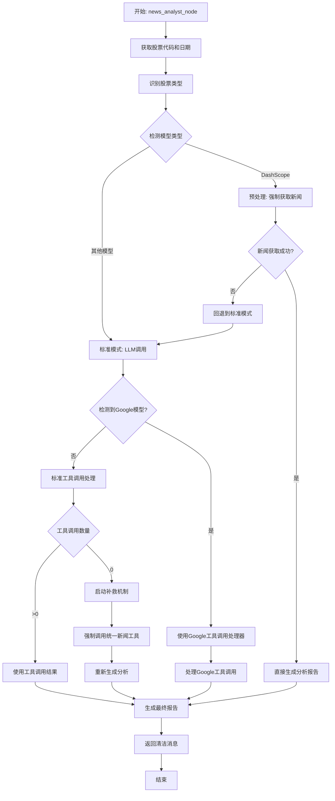

# 新闻分析师节点 - 接口定义文档

## 概述

本文档详细说明新闻分析师节点使用的新闻获取接口,包括接口的输入参数、输出格式、调用流程和数据源优先级。

## 新闻分析师节点概述

**文件位置**: `tradingagents/agents/analysts/news_analyst.py`

**节点名称**: `news_analyst_node`

**创建函数**: `create_news_analyst(llm, toolkit)`

**主要职责**:
- 获取和分析最新的实时新闻
- 评估新闻事件的紧急程度和市场影响
- 识别可能影响股价的关键信息
- 提供基于新闻的交易建议和价格影响评估

## 核心新闻获取接口

### 1. 统一新闻工具 (主要接口)

#### 接口名称
`get_stock_news_unified`

#### 文件位置
`tradingagents/tools/unified_news_tool.py`

#### 接口签名

```python
def get_stock_news_unified(
    stock_code: str, 
    max_news: int = 100, 
    model_info: str = "", 
    curr_date: str = None
) -> str
```

#### 输入参数

| 参数名 | 类型 | 必需 | 默认值 | 说明 |
|--------|------|------|--------|------|
| `stock_code` | str | ✅ | - | 股票代码,支持多种格式:<br>- A股: `000001`, `600000`, `SH600000`<br>- 港股: `0700.HK`, `0700`<br>- 美股: `AAPL`, `TSLA` |
| `max_news` | int | ❌ | 100 | 最大新闻数量 |
| `model_info` | str | ❌ | "" | 当前使用的模型信息,用于特殊处理<br>(如 Google 模型的长度控制) |
| `curr_date` | str | ❌ | None | 指定日期,格式: `YYYY-MM-DD`<br>如果为 None 则使用当前日期 |

#### 输出格式

返回格式化的字符串,包含以下部分:

```
=== 📰 新闻数据来源: {source} ===
获取时间: {timestamp}
数据长度: {length} 字符
模型类型: {model_info}
🔧 Google模型长度控制已应用 (原长度: {original_length} 字符)

=== 📋 新闻内容 ===
{news_content}

=== ✅ 数据状态 ===
状态: 成功获取
来源: {source}
时间戳: {timestamp}
```

**示例输出**:

```
=== 📰 新闻数据来源: 东方财富实时新闻 ===
获取时间: 2025-11-26 10:20:30
数据长度: 2500 字符
模型类型: ChatDashScope:qwen-plus

=== 📋 新闻内容 ===
【标题】万科A发布2024年第三季度财报
【时间】2025-11-26 09:30:00
【来源】东方财富网
【内容】万科A(000002)今日发布2024年第三季度财报...

【标题】万科A获机构调研
【时间】2025-11-26 08:15:00
【来源】证券时报
【内容】近日,万科A接待了多家机构调研...

=== ✅ 数据状态 ===
状态: 成功获取
来源: 东方财富实时新闻
时间戳: 2025-11-26 10:20:30
```

#### 股票类型识别逻辑

工具会自动识别股票类型:

```python
def _identify_stock_type(stock_code: str) -> str:
    """
    A股判断:
    - 正则: ^(00|30|60|68)\d{4}$  (如 000001, 600000)
    - 正则: ^(SZ|SH)\d{6}$        (如 SZ000001, SH600000)
    
    港股判断:
    - 正则: ^\d{4,5}\.HK$         (如 0700.HK)
    - 正则: ^\d{4,5}$             (如 0700, 长度≤5)
    
    美股判断:
    - 正则: ^[A-Z]{1,5}$          (如 AAPL, TSLA)
    - 包含 '.' 但不以 '.HK' 结尾
    
    默认: A股
    """
```

## 数据源优先级

### A股新闻数据源

按优先级顺序:

1. **东方财富实时新闻** (最高优先级)
   - 工具方法: `toolkit.get_realtime_stock_news`
   - 调用方式: `.invoke({"ticker": stock_code, "curr_date": curr_date})`
   - 成功条件: 返回内容 > 100 字符

2. **Google 新闻** (中文搜索)
   - 工具方法: `toolkit.get_google_news`
   - 搜索查询: `"{stock_code} 股票 新闻 财报 业绩"`
   - 调用方式: `.invoke({"query": query, "curr_date": curr_date})`
   - 成功条件: 返回内容 > 50 字符

3. **OpenAI 全球新闻**
   - 工具方法: `toolkit.get_global_news_openai`
   - 调用方式: `.invoke({"curr_date": curr_date})`
   - 成功条件: 返回内容 > 50 字符

### 港股新闻数据源

按优先级顺序:

1. **Google 新闻** (港股搜索)
   - 工具方法: `toolkit.get_google_news`
   - 搜索查询: `"{stock_code} 港股 香港股票 新闻"`
   - 成功条件: 返回内容 > 50 字符

2. **OpenAI 全球新闻**
   - 工具方法: `toolkit.get_global_news_openai`
   - 成功条件: 返回内容 > 50 字符

3. **实时新闻** (如果支持港股)
   - 工具方法: `toolkit.get_realtime_stock_news`
   - 成功条件: 返回内容 > 100 字符

### 美股新闻数据源

按优先级顺序:

1. **OpenAI 全球新闻** (最高优先级)
   - 工具方法: `toolkit.get_global_news_openai`
   - 成功条件: 返回内容 > 50 字符

2. **Google 新闻** (英文搜索)
   - 工具方法: `toolkit.get_google_news`
   - 搜索查询: `"{stock_code} stock news earnings financial"`
   - 成功条件: 返回内容 > 50 字符

3. **FinnHub 新闻**
   - 工具方法: `toolkit.get_finnhub_news`
   - 调用方式: `.invoke({"symbol": stock_code, "max_results": min(max_news, 50)})`
   - 成功条件: 返回内容 > 50 字符

## 特殊处理机制

### 1. Google 模型长度控制

当检测到 Google/Gemini 模型时,会进行特殊的长度控制:

```python
# 检测条件
is_google_model = any(keyword in model_info.lower() 
                     for keyword in ['google', 'gemini', 'gemma'])

# 长度控制策略
if is_google_model and len(news_content) > 5000:
    # 目标长度: 3000 字符
    # 优先保留包含关键词的重要行
    # 关键词: 股票、公司、财报、业绩、涨跌、价格等
```

**关键词列表**:
```python
important_keywords = [
    '股票', '公司', '财报', '业绩', '涨跌', '价格', '市值', 
    '营收', '利润', '增长', '下跌', '上涨', '盈利', '亏损', 
    '投资', '分析', '预期', '公告'
]
```

### 2. DashScope 模型预处理

当检测到 DashScope 模型时,会进行预处理强制新闻获取:

```python
if 'DashScope' in llm.__class__.__name__:
    # 预先获取新闻数据
    pre_fetched_news = unified_news_tool(
        stock_code=ticker, 
        max_news=10, 
        model_info=model_info, 
        curr_date=current_date
    )
    
    # 直接基于预获取的新闻生成分析,跳过工具调用
    if pre_fetched_news and len(pre_fetched_news.strip()) > 100:
        # 使用预获取的新闻直接生成分析
        result = llm.invoke([{"role": "user", "content": enhanced_prompt}])
        return result
```

### 3. 工具调用失败补救机制

如果 LLM 没有调用工具,会启动补救机制:

```python
if tool_call_count == 0:
    # 强制获取新闻数据
    forced_news = unified_news_tool(
        stock_code=ticker, 
        max_news=10, 
        model_info="", 
        curr_date=current_date
    )
    
    # 基于真实新闻数据重新生成分析
    if forced_news and len(forced_news.strip()) > 100:
        forced_result = llm.invoke([{
            "role": "user", 
            "content": forced_prompt
        }])
        return forced_result
```

## 新闻分析师节点调用流程



## 底层新闻获取工具

### 1. 东方财富实时新闻

**工具方法**: `get_realtime_stock_news`

**实现文件**: `tradingagents/dataflows/realtime_news_utils.py`

**函数签名**:
```python
def get_realtime_stock_news(
    ticker: str, 
    curr_date: str, 
    hours_back: int = 6
) -> str
```

**输入参数**:
- `ticker`: 股票代码
- `curr_date`: 指定日期 (YYYY-MM-DD)
- `hours_back`: 回溯小时数,默认 6

**输出格式**: 格式化的新闻报告字符串

**数据源**:
- 优先使用 `akshare.stock_news_em()` 获取东方财富新闻
- 包含新闻标题、时间、来源、内容等信息

### 2. Google 新闻

**工具方法**: `get_google_news`

**输入参数**:
- `query`: 搜索查询字符串
- `curr_date`: 指定日期

**输出格式**: 新闻搜索结果

### 3. OpenAI 全球新闻

**工具方法**: `get_global_news_openai`

**输入参数**:
- `curr_date`: 指定日期

**输出格式**: 全球新闻数据

### 4. FinnHub 新闻

**工具方法**: `get_finnhub_news`

**输入参数**:
- `symbol`: 股票代码
- `max_results`: 最大结果数

**输出格式**: FinnHub 新闻数据

## 使用示例

### 示例 1: 基本调用

```python
from tradingagents.tools.unified_news_tool import create_unified_news_tool

# 创建统一新闻工具
unified_news_tool = create_unified_news_tool(toolkit)

# 获取A股新闻
news = unified_news_tool(
    stock_code="000002",
    max_news=10,
    curr_date="2025-11-26"
)

print(news)
```

### 示例 2: 在新闻分析师中使用

```python
from tradingagents.agents.analysts.news_analyst import create_news_analyst

# 创建新闻分析师节点
news_analyst = create_news_analyst(llm, toolkit)

# 调用节点
state = {
    "company_of_interest": "000002",
    "trade_date": "2025-11-26",
    "messages": [],
    "session_id": "test_session"
}

result = news_analyst(state)

# 获取新闻报告
news_report = result["news_report"]
print(news_report)
```

### 示例 3: 不同股票类型

```python
# A股
news_a = unified_news_tool(stock_code="000001", curr_date="2025-11-26")

# 港股
news_hk = unified_news_tool(stock_code="0700.HK", curr_date="2025-11-26")

# 美股
news_us = unified_news_tool(stock_code="AAPL", curr_date="2025-11-26")
```

## 错误处理

### 无法获取新闻

如果所有数据源都失败,返回:

```
❌ 无法获取{股票类型}新闻数据，所有新闻源均不可用
```

### 股票代码未提供

```
❌ 错误: 未提供股票代码
```

### 数据源失败日志

每个数据源失败时会记录警告日志:

```python
logger.warning(f"[统一新闻工具] 东方财富新闻获取失败: {e}")
logger.warning(f"[统一新闻工具] Google新闻获取失败: {e}")
logger.warning(f"[统一新闻工具] OpenAI新闻获取失败: {e}")
```

## 性能优化

### 1. 数据源优先级

- 根据股票类型选择最佳数据源
- 优先使用速度快、质量高的数据源
- 失败后自动降级到备用数据源

### 2. 长度控制

- Google 模型: 智能截断到 3000-4000 字符
- 保留包含关键词的重要内容
- 避免超长内容导致的性能问题

### 3. 缓存机制

- 底层工具可能实现缓存
- 避免重复获取相同数据

## 配置选项

可以通过模块化环境变量配置新闻数据源:

```bash
# tradingagents/dataflows/.env

# 启用/禁用特定新闻源
NEWS_FINNHUB_ENABLED=true
NEWS_NEWSAPI_ENABLED=false
NEWS_TUSHARE_ENABLED=true
NEWS_AKSHARE_ENABLED=true

# 默认参数
NEWS_DEFAULT_HOURS_BACK=6
NEWS_DEFAULT_MAX_NEWS=10
```

详见 [模块化环境变量配置文档](../modular_env_config.md)

## 相关文档

- [新闻数据源分析](./news1.md) - 新闻数据源详细分析
- [新闻获取优化](./news2.md) - 新闻获取性能优化
- [新闻接口重构](./news3.md) - 新闻接口重构方案
- [模块化环境变量配置](../modular_env_config.md) - 配置管理

## 总结

新闻分析师节点通过 `get_stock_news_unified` 统一接口获取新闻数据,该接口:

✅ **自动识别股票类型**: A股、港股、美股  
✅ **智能选择数据源**: 根据股票类型和可用性选择最佳数据源  
✅ **多级降级策略**: 主数据源失败时自动切换到备用数据源  
✅ **特殊模型优化**: 针对 Google 和 DashScope 模型的特殊处理  
✅ **补救机制**: 工具调用失败时强制获取新闻数据  
✅ **格式化输出**: 统一的、结构化的新闻数据格式  

这个设计确保了新闻分析师节点能够稳定、高效地获取各类股票的新闻数据。
